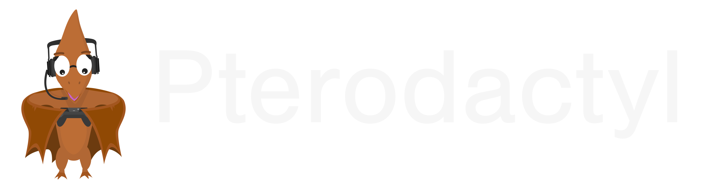
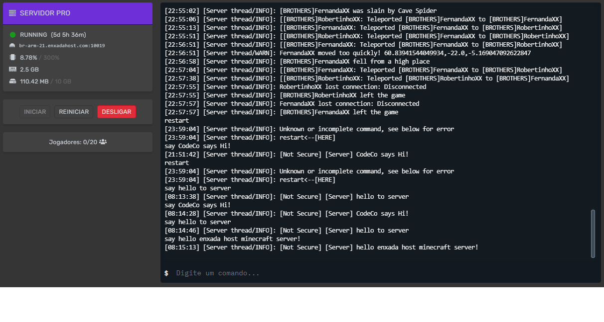
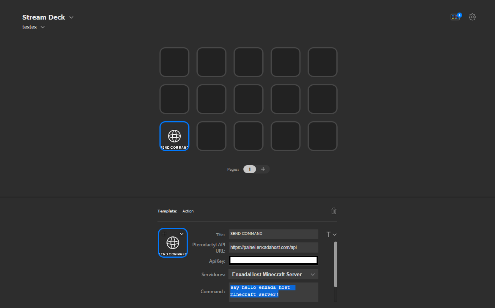
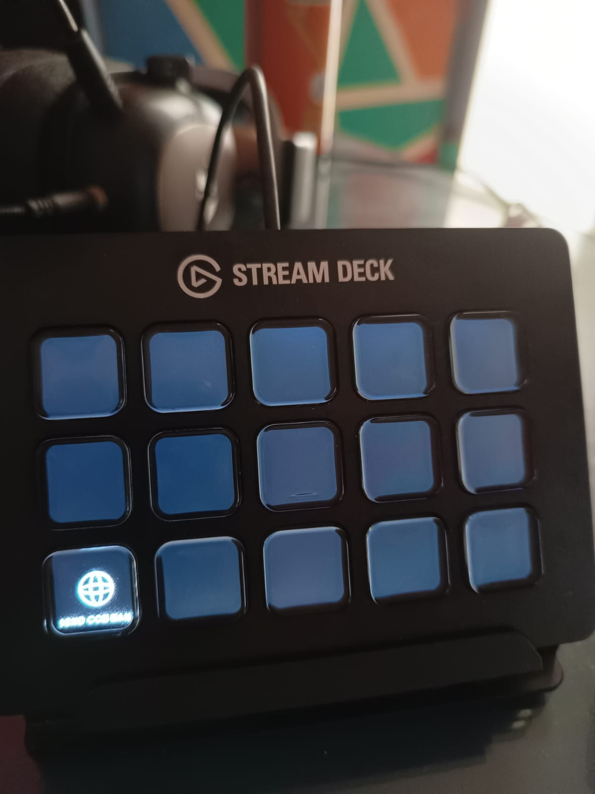

# Pterodactyl Stream Deck Command plugin

A easily plugin to send commands to pterodactyl api 

[About Pterodactyl](https://pterodactyl.io/)

This project uses https://github.com/ChekTek/streamdeck-plugin-template-js-no-build as skeleton.

# Under development. First stage.

